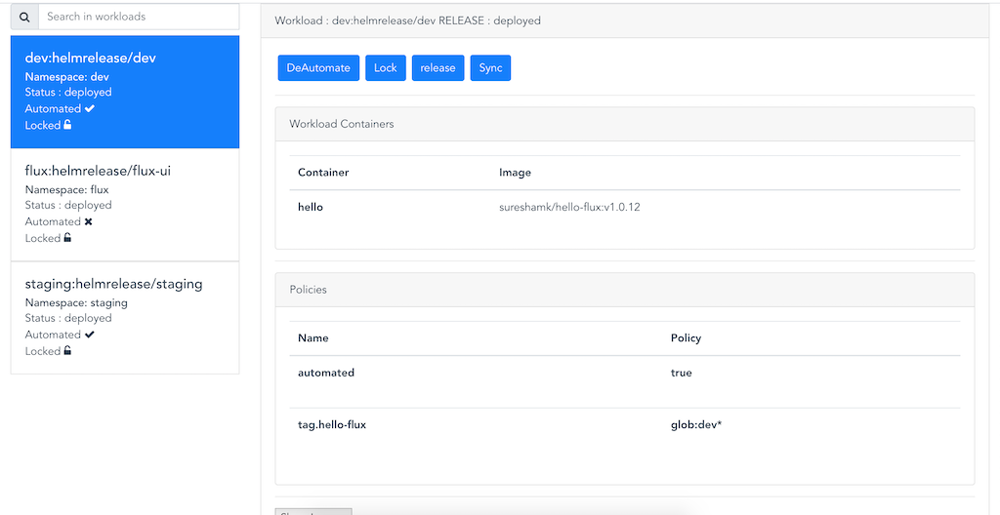
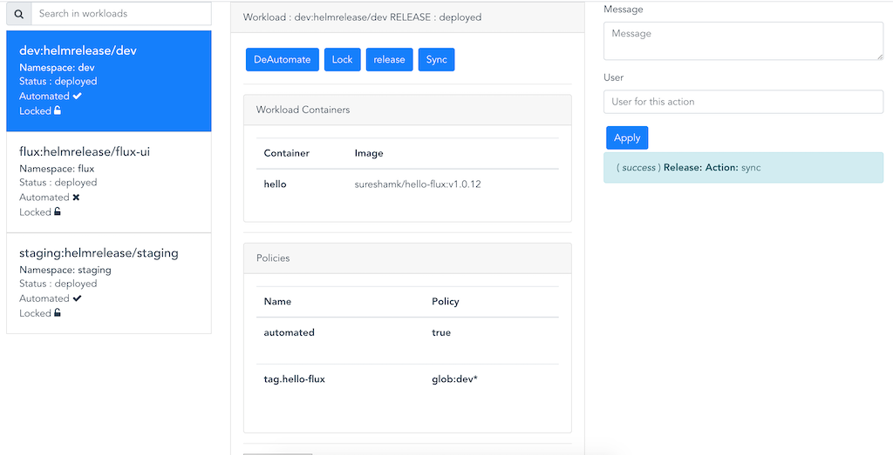
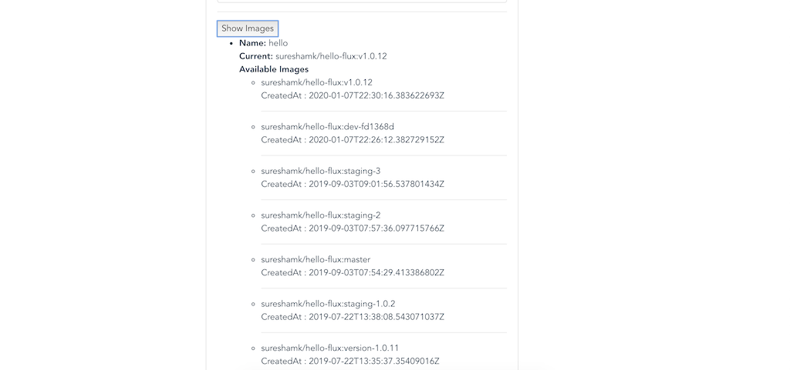

# Flux-ui 
This is project for providing web ui for fluxctl. 

### Home 

### View workloads 

### deal with actions
* Lock / unlock the workload
* Automate / de-automate the workload
* Release the workload
* sync

### List images 

## Support

* Please don't write mails directly to the maintainers.
* Use the Github issue tracker instead.